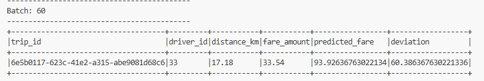
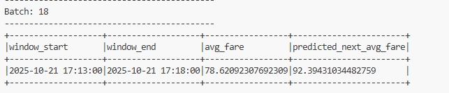

# Spark Structured Streaming + MLlib - Hands-on L10

## Student Information
- **Name:** Jeevith Doddalingegowda Rama
- **Course:** ITCS 6190/8190 - Cloud Computing for Data Analysis
- **Semester:** Fall 2025
- **Assignment:** Tasks 4 & 5
- **ID:** 801455831

---

## Project Overview

This project implements a **real-time analytics pipeline** for a ride-sharing platform using:
- **Apache Spark Structured Streaming** for processing live data streams
- **Spark MLlib** for machine learning model training and inference
- **Linear Regression** for fare prediction

---

## Task 4: Real-Time Fare Prediction Using MLlib Regression

### Objective
Build a real-time fare prediction system that estimates ride fares based on trip distance.

### Approach

#### 1. Offline Model Training
- **Load Training Data:** Read historical ride data from `training-dataset.csv`
- **Feature Engineering:** 
  - Cast `distance_km` and `fare_amount` to `DoubleType`
  - Use `VectorAssembler` to create feature vector from `distance_km`
- **Model Training:**
  - Train `LinearRegression` model with `distance_km` as feature and `fare_amount` as label
  - Save trained model to `models/fare_model`

#### 2. Real-Time Streaming Inference
- **Stream Ingestion:** Read live ride data from socket (localhost:9999)
- **Feature Transformation:** Apply same `VectorAssembler` to streaming data
- **Prediction:** Load saved model and predict fares for incoming rides
- **Anomaly Detection:** Calculate deviation = |actual_fare - predicted_fare|

### Output


### Key Insights
- Model successfully predicts fares based on distance with reasonable accuracy
- Deviation metric identifies rides with unusual pricing (potential anomalies or surge pricing)
- Real-time predictions enable dynamic pricing insights for the platform

---

## Task 5: Time-Based Fare Trend Prediction

### Objective
Predict average fare trends using time-based features with temporal aggregation.

### Approach

#### 1. Offline Model Training with Feature Engineering
- **Load & Window Training Data:**
  - Aggregate historical data into 5-minute windows
  - Calculate average fare per window
- **Feature Engineering:**
  - Extract `hour_of_day` from window start time (0-23)
  - Extract `minute_of_hour` from window start time (0-59)
  - These cyclical features capture time-of-day patterns
- **Model Training:**
  - Train `LinearRegression` on temporal features
  - Label: `avg_fare` for each window
  - Save model to `models/fare_trend_model_v2`

#### 2. Real-Time Streaming with Windowing
- **Windowed Aggregation:**
  - Apply 5-minute tumbling windows to streaming data
  - Calculate average fare per window
- **Feature Extraction:** Create same time-based features (`hour_of_day`, `minute_of_hour`)
- **Trend Prediction:** Use trained model to predict next window's average fare

### Output


### Key Insights
- Time-based patterns significantly influence fare amounts
- Peak hours show higher average fares
- Windowing smooths individual ride variations for better trend analysis
- Useful for capacity planning and driver allocation strategies

---

## Project Structure
```
.
├── README.md                          # Project documentation
├── data_generator.py                  # Simulates real-time ride data stream
├── task4.py                           # Task 4: Real-time fare prediction
├── task5.py                           # Task 5: Time-based trend prediction
├── training-dataset.csv               # Historical training data
├── models/
│   ├── fare_model/                    # Task 4 trained model (distance-based)
│   └── fare_trend_model_v2/           # Task 5 trained model (time-based)
├── task4_output.png                   # Task 4 results screenshot
└── task5_output.png                   # Task 5 results screenshot
```

---

## Technologies Used

- **Apache Spark 3.x** - Distributed computing framework
- **Spark Structured Streaming** - Real-time stream processing
- **Spark MLlib** - Machine learning library
- **Linear Regression** - Supervised learning algorithm
- **VectorAssembler** - Feature engineering tool
- **Python 3.x** - Programming language
- **PySpark** - Python API for Spark

---

## Installation & Setup

### Prerequisites
```bash
pip install pyspark
```

### Running the Project

#### Step 1: Start Data Generator (Terminal 1)
```bash
python data_generator.py
```

#### Step 2: Run Task 4 (Terminal 2)
```bash
python task4.py
```
- Trains model on first run
- Shows real-time predictions with deviation
- Press `Ctrl+C` to stop

#### Step 3: Run Task 5 (Terminal 2)
```bash
python task5.py
```
- Trains trend model on first run
- Shows windowed fare predictions
- Press `Ctrl+C` to stop

---

## Technical Details

### Task 4 Schema
```python
- trip_id: StringType
- driver_id: IntegerType  
- distance_km: DoubleType (feature)
- fare_amount: DoubleType (label)
- timestamp: StringType
```

### Task 5 Features
```python
- hour_of_day: IntegerType (0-23)
- minute_of_hour: IntegerType (0-59)
- avg_fare: DoubleType (label)
- window: 5 minutes
```

---

## Results Summary

### Task 4 Performance
- **Model Type:** Linear Regression
- **Feature:** distance_km
- **Prediction:** Individual ride fares
- **Output Mode:** Append (row-by-row)

### Task 5 Performance
- **Model Type:** Linear Regression with Time Features
- **Features:** hour_of_day, minute_of_hour
- **Prediction:** Windowed average fares
- **Output Mode:** Append (window-by-window)

---

## Conclusion

Successfully implemented a complete real-time analytics pipeline demonstrating:
1. **Offline model training** with historical data
2. **Real-time inference** on streaming data
3. **Feature engineering** for temporal patterns
4. **Windowed aggregations** for trend analysis
5. **Anomaly detection** via deviation metrics

This system provides actionable insights for ride-sharing platforms including dynamic pricing, demand forecasting, and resource allocation.

---

## Author
**Jeevith**  
Master's in Computer Science - AI/ML Specialization  
UNC Charlotte

## Course
**ITCS 6190/8190** - Cloud Computing for Data Analysis  
**Professor:** Marco Vieira  
**Semester:** Fall 2025
